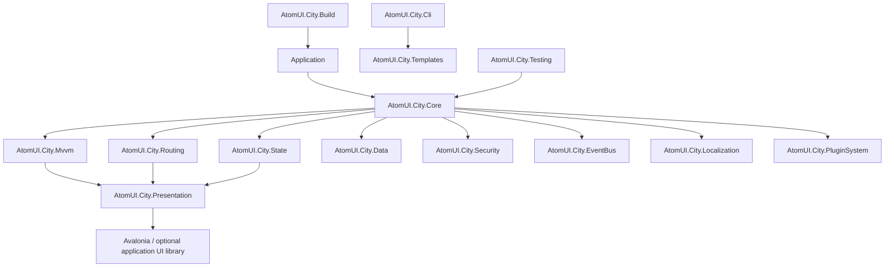

# AtomUI.City 整体架构设计

版本：v0.1
状态：正式初版
适用范围：AtomUI.City 框架整体架构、包边界、编程范式和基础设施设计

## 1. 框架定位

AtomUI.City 是面向 Avalonia 生态的全栈 UI 业务应用框架，可由应用选择 AtomUI 或其他控件库。

它的目标不是提供一组零散工具类，而是为桌面业务软件提供一套完整的应用开发范式，包括应用启动、模块化、生命周期、MVVM、状态管理、路由、数据访问、安全、本地化、插件、构建、CLI、模板和测试基础设施。

AtomUI.City 在 Avalonia 生态中的定位是应用框架层：它会提供框架级约定，并把这些约定强加给应用开发者，从而换取一致的工程结构、清晰的生命周期、可组合的模块边界和可维护的业务代码组织方式。

底层 UI 运行时由 Avalonia 承担；控件、主题、视觉系统和基础样式由应用选择 AtomUI 或其他控件库。AtomUI.City 不重造 UI 控件库。

## 2. 核心设计原则

AtomUI.City 第一版遵循以下原则：

- MVVM-first：ViewModel 是业务交互和 UI 状态组织的主要承载点。
- Lifecycle-first：应用、模块、路由、ViewModel、状态、事件订阅和命令执行都必须有明确生命周期。
- Module-first：模块是应用功能组织、依赖声明、服务注册和扩展能力贡献的基本单位。
- Route-driven：路由是页面进入、ViewModel Target 选择、权限校验、数据预取和生命周期切换的重要入口。
- State-aware：框架需要识别状态、计算状态、状态副作用和状态快照，而不是把状态当作普通属性散落在各处。
- Host-based：应用启动、DI、配置、模块加载和全局错误处理由统一 Host 管理。
- Business-agnostic：框架层只提供业务无关能力，不内置具体业务形态。
- C#-native API：公共 API 应符合 .NET/C# 生态习惯，不刻意引入 TypeScript 或 Rx 风格命名。
- AOT-first / Source-generator-first：框架设计必须默认考虑 AOT、trimming、启动性能和包体积，优先使用显式注册、强类型 descriptor、构建期 manifest 和 source generator，尽可能避免运行时程序集扫描、反射发现、动态代理和表达式树编译。
- Optional interop：ReactiveUI、Rx 等生态能力可以作为适配层接入，但不作为默认核心范式。

## 3. 非目标

第一版明确不做以下事情：

- 不引入 DDD 作为默认编程模型。
- 不提供领域模型、仓储、应用服务等 DDD 包。
- 不在框架层内置 Workbench、Documents、Dashboard 等具体业务形态。
- 不把 ReactiveUI 作为默认底层依赖。
- 不把 IObservable 作为状态、命令、路由和事件系统的主公共 API。
- 不重造应用控件库已经承担的控件、主题和视觉系统。
- 不把包拆得过细。
- 不把运行时反射扫描作为默认发现机制。

复杂业务应用可以自行引入领域层、DDD 架构、CQRS、工作台模型或其他业务组织方式，但它们不是 AtomUI.City v1 的默认框架职责。

## 4. 总体架构

AtomUI.City 的整体结构分为五层：

- Host Layer：应用启动、DI、配置、模块、生命周期、全局错误处理。
- Application Framework Layer：MVVM、State、Routing、Data、Security、EventBus、Localization、PluginSystem。
- Presentation Integration Layer：Avalonia 运行时集成、ViewLocator、Activation 接入、UI Dispatcher、Interaction Handler。
- Engineering Layer：Build、CLI、Templates、Testing。
- UI Foundation Layer：Avalonia，以及应用可选的 AtomUI 等控件库。



框架主路径：

```text
Route -> ViewModel -> State / Data / EventBus / Security -> Presentation -> Avalonia / optional UI library
```

这条路径表达的是默认编程模型，而不是限制。业务应用仍可以根据自身复杂度增加领域层、应用服务层或其他内部结构。

## 5. 包结构

AtomUI.City v1 包结构如下：

| 包 | 职责 |
|---|---|
| AtomUI.City.Core | Host、DI、配置、模块、生命周期基础、应用上下文、调度抽象、全局错误处理 |
| AtomUI.City.Mvvm | ViewModel、命令、Activation、Interaction、验证、CommunityToolkit.Mvvm 集成 |
| AtomUI.City.State | 状态值、可写状态、计算状态、Reaction、StateScope、Snapshot、集合状态 |
| AtomUI.City.Routing | 路由定义、导航、守卫、解析器、路由生命周期、Route 到 ViewModel Target 的映射 |
| AtomUI.City.Data | 数据请求、客户端代理、请求管线、缓存、错误模型、认证集成 |
| AtomUI.City.Security | 认证状态、权限检查、授权策略、路由和命令权限联动 |
| AtomUI.City.EventBus | 类型事件总线、作用域订阅、事件通道、线程调度、错误策略 |
| AtomUI.City.Localization | 本地化资源、文化切换、文本刷新、模块化资源注册 |
| AtomUI.City.Presentation | Avalonia 运行时集成、ViewLocator、UI Dispatcher、Activation 接入、Interaction Handler |
| AtomUI.City.PluginSystem | 插件发现、插件元数据、插件加载、插件模块注册、插件生命周期 |
| AtomUI.City.Build | 构建约定、资源生成、模块清单、路由清单、输出组织 |
| AtomUI.City.Cli | 项目创建、模块生成、路由生成、构建命令、模板调用 |
| AtomUI.City.Templates | 应用模板、模块模板、页面模板、插件模板、测试模板 |
| AtomUI.City.Testing | 测试 Host、测试 Dispatcher、生命周期驱动、状态/路由/EventBus 测试工具 |

Core 内部可以包含 Hosting、Lifecycle、Modularity、Configuration 等命名空间，但不拆成独立 NuGet 包。

## 6. Core

AtomUI.City.Core 是框架运行时内核。

核心职责：

- 创建应用 Host。
- 管理 DI 容器。
- 管理配置系统。
- 发现和加载模块。
- 管理模块依赖和初始化顺序。
- 管理应用生命周期。
- 提供应用上下文。
- 提供 Dispatcher 抽象。
- 提供全局错误处理管道。

Core 聚焦 Host、Module、Configuration、DI 和生命周期等框架内核能力，不包含应用层、领域层和业务模块体系。

Core 不依赖 AtomUI/Avalonia，不依赖 CommunityToolkit.Mvvm，不依赖 ReactiveUI，不依赖 System.Reactive。

## 7. Module System

模块是 AtomUI.City 应用组织的基础单位。

模块可以贡献：

- 服务注册。
- 配置项。
- 路由。
- 权限。
- 本地化资源。
- 数据客户端。
- 事件处理器。
- 插件扩展点。
- Presentation 资源。

模块生命周期包括：

```text
Discover -> PreConfigure -> ConfigureServices -> Configure -> Initialize -> Started -> Stopping -> Stopped
```

模块系统需要支持：

- 显式模块依赖。
- 模块拓扑排序。
- 重复模块检测。
- 缺失依赖诊断。
- 初始化错误报告。
- 模块级服务注册。
- 模块级资源注册。
- 模块级路由注册。

模块系统属于 Core 的一部分，不单独拆包。

## 8. Lifecycle

生命周期是 AtomUI.City 的核心设计重心。

AtomUI.City 需要统一管理以下生命周期：

| 层级 | 生命周期关注点 |
|---|---|
| Application | 创建、配置、初始化、启动、挂起、恢复、关闭 |
| Module | 发现、配置、初始化、启用、停止 |
| Route | 匹配、守卫、解析、进入、离开、释放 |
| ViewModel | 创建、激活、停用、释放 |
| StateScope | 创建、订阅、Reaction、快照、清理 |
| EventBus Subscription | 订阅、调度、错误处理、释放 |
| Command | 可执行、执行中、完成、失败、取消 |

ViewModel 不应该在构造阶段建立长期订阅。状态订阅、EventBus 订阅、Interaction Handler、Reaction 和可释放资源应该绑定到 Activation Scope。

Activation Scope 的职责：

- 收集可释放资源。
- 关联取消令牌。
- 管理 ViewModel 激活期间的订阅。
- 在 ViewModel 停用时统一释放。
- 避免重复订阅和内存泄漏。

这一点要求 AtomUI.City 提供自己的 ViewModel 激活模型和作用域释放机制。

## 9. MVVM

AtomUI.City.Mvvm 采用 CommunityToolkit.Mvvm 作为基础依赖。

直接复用：

- ObservableObject。
- ObservableValidator。
- IRelayCommand。
- IAsyncRelayCommand。
- RelayCommand。
- AsyncRelayCommand。
- ObservableProperty source generator。
- RelayCommand source generator。

AtomUI.City.Mvvm 在 CommunityToolkit.Mvvm 之上补充：

- ViewModelBase。
- ViewModel Activation。
- Activation Scope。
- Interaction Request。
- Command 错误策略。
- Command 与权限联动。
- Command 与路由状态联动。
- State Reaction 自动释放。
- EventBus Subscription 自动释放。

命令命名沿用 .NET MVVM 生态已有名称，不额外添加 City 前缀。

MVVM 层不直接承担路由、数据访问、安全和插件职责，但需要和这些框架能力有清晰集成点。

## 10. State

AtomUI.City.State 使用 C# 风格的状态、计算状态、Reaction 和快照模型。

核心概念：

| 概念 | 职责 |
|---|---|
| IReadOnlyState<T> / IStateValue<T> | 只读状态及其最小值视图，具有当前值语义 |
| IWritableState<T> | 可写状态，支持 Set 和 Update |
| IComputedState<T> | 计算状态，基于依赖状态自动更新 |
| IStateReaction | 状态副作用订阅，必须可释放 |
| IStateScope | 状态生命周期作用域 |
| IStateCollection<TKey,TItem> | 集合状态，支持按 key 管理项目 |
| StateSnapshot | 状态快照，用于持久化、恢复和测试断言 |

State 设计原则：

- 状态必须具有当前值语义。
- 状态变化可以被观察，但 IObservable 不是唯一入口。
- 计算状态应支持依赖追踪。
- Reaction 必须绑定生命周期。
- 状态错误不应导致状态对象死亡。
- 状态更新需要支持 UI Dispatcher 策略。
- 状态快照需要考虑 AOT 和序列化兼容。

System.Reactive 可以在后续适配包中支持，但不作为 State 的第一版核心依赖。

## 11. Routing

AtomUI.City.Routing 是应用结构和页面进入路径的核心。

Routing 需要支持完整的路由图、导航状态、生命周期、权限守卫和数据解析，不只是 ViewModel 栈或区域切换。

核心能力：

- 路由定义。
- 路由参数。
- 嵌套路由。
- 布局。
- 路由守卫。
- 数据解析器。
- 路由生命周期。
- 路由级 DI Scope。
- 路由级模块加载。
- Route 到 ViewModel Target 的显式映射。
- 当前路由状态。
- 导航结果和错误诊断。

Routing 不应该依赖命名约定自动猜测 ViewModel Target。ViewModel 到 View 的定位、View 创建和绑定由 Presentation 负责。

## 12. EventBus

AtomUI.City.EventBus 独立成包。

EventBus 目标是解决模块间、组件间和框架内部的解耦通信问题。

核心能力：

- 强类型事件和稳定事件契约。
- Shared Contract Plane 和 Plugin Private Plane。
- 强引用、生命周期托管订阅。
- Serialized、Partitioned 和 Concurrent channel。
- 有界队列和背压。
- 异步事件处理器。
- Core Threading 调度策略。
- 插件停用、drain 和卸载。
- 错误策略。
- 测试记录和断言支持。

EventBus 不直接基于 CommunityToolkit WeakReferenceMessenger 实现。AtomUI.City.EventBus 需要承担框架级生命周期、调度、错误处理和测试支持。

EventBus 不保存当前值，不提供 latest replay 或 sticky event。需要当前值和最新状态的场景使用 State。第一版不提供弱引用订阅，所有订阅必须显式绑定 Lifecycle Scope 或 ContributionLease。

## 13. Data

AtomUI.City.Data 负责业务应用的数据访问基础设施。

核心职责：

- 数据客户端抽象。
- 请求管线。
- 认证信息注入。
- 取消、超时、重试。
- 错误标准化。
- 加载状态。
- 缓存策略。
- 与 State 集成。
- 与 Security 集成。

Data 不提供 DDD Repository 作为默认模式。业务应用可以自行建立 Repository、Application Service 或其他数据访问封装。

Data 层应避免把具体传输协议强加给应用。HTTP、RPC、本地服务、插件服务都应该可以通过统一抽象接入。

## 14. Security

AtomUI.City.Security 提供通用认证和权限能力。

核心职责：

- 当前认证状态。
- 当前主体信息。
- 登录和登出抽象。
- Token 管理。
- 权限检查。
- 授权策略。
- 路由守卫集成。
- 命令可执行状态集成。
- UI 可见性和可用性辅助。

Security 不包含具体业务权限模型，但需要提供足够通用的 claim、role、permission 和 policy 抽象。

## 15. Localization

AtomUI.City.Localization 提供模块化本地化能力。

核心职责：

- 模块本地化资源注册。
- 文化切换。
- 当前文化状态。
- UI 文本刷新。
- 路由标题、命令文本、验证消息和错误消息本地化。
- 与 State、应用组合层和可选 UI 适配包集成；Presentation 主包不处理文案或 culture。

Localization 应支持模块独立贡献资源，并允许插件贡献本地化资源。

## 16. Presentation

AtomUI.City.Presentation 是 City 业务运行时与 Avalonia 之间的 UI 事务协调层。

核心职责：

- ViewLocator。
- View 创建。
- View/ViewModel 绑定。
- Visual tree activation 接入。
- UI Dispatcher。
- Interaction Handler。
- Dialog 集成。
- Route Outlet。
- Command Binding 增强。
- State 到 UI 的安全更新。
- 通用 UI resource contribution 的注册与撤销；文案和本地化刷新由 Localization 与应用组合层负责。

Presentation 层不提供具体业务 UI 形态，不内置 Workbench、Documents、Dashboard 等应用模型。

底层 UI 运行时由 Avalonia 提供，控件库和视觉系统由应用选择；Presentation 只负责框架运行时与 UI 运行时之间的连接。

## 17. PluginSystem

AtomUI.City.PluginSystem 独立成包。

PluginSystem 是运行时扩展机制，用于让应用在不修改主程序代码的情况下增加模块、路由、资源、权限、本地化、数据客户端、命令、事件处理器和 UI 集成能力。

PluginSystem 是全局一等架构能力，不只是 ModuleSystem 的附属工具。

架构级规则：

- 插件必须通过 Host 暴露的受控 contract 贡献能力。
- 插件贡献必须通过 Contribution Lease 管理，并支持撤销。
- 插件服务必须位于插件服务 Scope，不能污染 Host Root ServiceProvider。
- 插件生命周期必须接入全局 Lifecycle。
- 插件可以运行时加载、启用、停用和卸载。
- 插件卸载必须先阻止新入口、停用插件 UI、取消插件操作、撤销贡献、释放服务，再卸载程序集加载上下文。
- PluginSystem 提供生命周期、依赖、版本、贡献和错误隔离，但不提供进程内安全沙箱。

插件和模块的关系是：插件是运行时外部扩展单元，模块是应用内部组织单元。插件加载后通常通过插件模块向 Host 贡献能力，但插件和模块不是同一个概念。

插件可扩展范围和 Host 交互模型见：[插件系统架构规范](plugin-system.md)。

## 18. Build

AtomUI.City.Build 负责框架构建约定和构建期生成能力。

核心职责：

- 输出目录约定。
- 资源生成。
- 模块清单生成。
- 路由清单生成。
- 插件清单生成。
- 模板打包。
- 构建诊断。
- 与 MSBuild 集成。

构建输出应遵循统一 output 目录约定，与仓库现有构建系统保持一致。

## 19. CLI

AtomUI.City.Cli 是框架工程化入口。

核心职责：

- 创建应用。
- 创建模块。
- 创建页面骨架。
- 注册路由。
- 注册权限。
- 生成本地化资源。
- 构建应用。
- 打包应用。
- 管理模板。

CLI 不只是脚手架工具，也应该成为框架开发生命周期的一部分。

## 20. Templates

AtomUI.City.Templates 提供标准项目模板。

模板类型：

- 应用模板。
- 模块模板。
- 页面模板。
- ViewModel 模板。
- Dialog 模板。
- 插件模板。
- 测试模板。

模板需要体现 AtomUI.City 的默认编程范式，而不是只创建空项目文件。

## 21. Testing

AtomUI.City.Testing 提供框架级测试基础设施。

核心能力：

- Test Host。
- Test Module。
- Fake Dispatcher。
- 生命周期驱动器。
- 路由测试工具。
- State Snapshot 断言。
- EventBus 测试记录器。
- Command 执行测试工具。
- Presentation-free ViewModel 测试支持。

Testing 需要提供可替换的调度和时间控制能力，但不强依赖 Rx。

AtomUI.City.Testing 的目标是让应用可以测试框架编程模型本身，而不是只测试孤立工具类。

## 22. 依赖策略

第一版依赖策略：

| 包 | 依赖策略 |
|---|---|
| AtomUI.City.Core | 不依赖 AtomUI、不依赖 CommunityToolkit.Mvvm、不依赖 ReactiveUI、不依赖 System.Reactive |
| AtomUI.City.Mvvm | 依赖 CommunityToolkit.Mvvm |
| AtomUI.City.State | 不依赖 ReactiveUI，不要求 System.Reactive |
| AtomUI.City.EventBus | 自研实现，不基于 WeakReferenceMessenger |
| AtomUI.City.Presentation | 硬依赖 Avalonia；AtomUI 可选且由应用引入 |
| AtomUI.City.Routing | 依赖 Core，可与 Presentation 集成 |
| AtomUI.City.Data | 依赖 Core，可与 Security 和 State 集成 |
| AtomUI.City.Security | 依赖 Core，可与 Routing 和 Mvvm 集成 |
| AtomUI.City.Testing | 依赖框架核心包，提供测试 Host 和测试工具 |

后续可考虑扩展包：

- AtomUI.City.Reactive
- AtomUI.City.ReactiveUI

这些扩展包用于 Rx 和 ReactiveUI 互操作，不进入 v1 核心依赖链。

## 23. 编程范式

AtomUI.City 的默认编程范式是：

```text
创建模块
-> 注册服务和配置
-> 声明路由和权限
-> 编写 ViewModel
-> 使用 State / Data / EventBus / Security
-> 由 Lifecycle 管理激活、订阅和释放
-> 由 Presentation 接入 Avalonia；控件库由应用选择
```

应用开发者需要接受框架约定：

- 功能应通过模块组织。
- 页面进入应通过路由组织。
- UI 交互逻辑应通过 ViewModel 承载。
- 可持续状态应进入 State 体系。
- 长期订阅应绑定 Activation Scope。
- 跨模块通信应通过 EventBus。
- 权限应进入 Security。
- 数据请求应进入 Data 管线。
- UI 集成应通过 Presentation。

## 24. 总结

AtomUI.City 的架构路线是：围绕 Avalonia 建立完整的桌面业务应用框架，允许应用选择 AtomUI 等控件库，并统一 Host、模块、生命周期、MVVM、状态、路由、数据、安全、事件、插件、构建、CLI、模板和测试能力。

第一版最重要的目标不是功能铺满，而是建立稳定的框架范式和包边界：

- Core 负责 Host、Module、Lifecycle、DI 和配置。
- Mvvm 负责 ViewModel、Command、Activation 和 Interaction。
- State 负责状态、计算状态、Reaction 和 Snapshot。
- Routing 负责路由图、导航、守卫、解析和 ViewModel Target 选择。
- Data 负责数据访问基础设施。
- Security 负责认证和权限。
- EventBus 负责解耦通信。
- Presentation 负责 Avalonia 运行时集成，不决定应用控件库。
- PluginSystem 负责外部扩展。
- Build、Cli、Templates 和 Testing 支撑完整开发生命周期。

该设计保持业务无关，不预设具体应用形态，为后续按模块拆分详细设计文档提供母稿。
