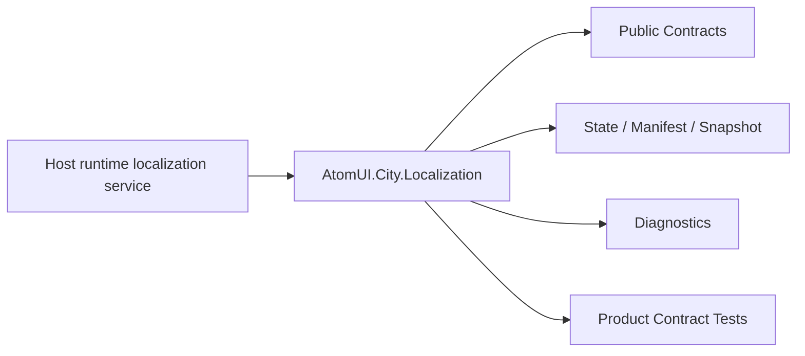

# AtomUI.City.Localization Architecture

## 架构目标

AtomUI.City.Localization 的架构目标是把模块职责变成可实现、可测试、可 review 的产品级合同。

- 按当前 culture 懒加载语言包。
- 支持文件和独立 assembly 语言包。

## 核心不变量

- 语言包按当前 culture 懒加载。
- provider 必须可撤销。
- 缺失 key 必须诊断并走 fallback。
- 插件语言包卸载后不得出现在 lookup。

## 核心概念和所有权

| 概念 | 职责 | 创建者 | 释放/失效规则 |
| --- | --- | --- | --- |
| CultureState | 当前 culture、递归 fallback 链、revision 和 loaded package 的深只读快照。 | LocalizationService 通过 City.State 创建 | LocalizationService Dispose；消费者只持有 `IReadOnlyState<CultureState>`，不能通过可变 `CultureInfo` 反向修改 snapshot。 |
| LanguagePackageRegistry | `(culture, packageId)` descriptor 的唯一事实源，支持原子批量注册。 | Host/DI | owner revoke 失效；service 解除事件后释放。 |
| LanguagePackage | 一个 culture 的字符串资源集合。 | Provider | cache 替换、owner/contribution revoke 或 service Dispose 释放。 |
| LocalizedText | 捕获 lookup context 的可订阅文案。 | LocalizationService | binding 或 service Dispose；Dispose 返回后不再开始通知。 |
| LocalizationScopeLease | Module/Plugin/Route/Window 活动资源引用。 | LocalizationService | 最后一个 lease Dispose 后作用域不可见。 |

## 产品级状态机

Localization 1.0 不公开状态枚举。源码使用下列隐式生命周期合同：

- `LocalizationService`: Running -> Disposing -> Disposed；Dispose/DisposeAsync 共享一个完成事务。
- Culture mutation: Queued -> Preparing -> Committed -> PostCommitRefresh -> Completed/Failed；调用方取消只在 Committed 前有效。
- Package load: Registered -> Loading -> Loaded/Cached，或 Failed/Cancelled/Revoked；只有成功且仍注册的 package 可以进入 cache。

## 关键运行流程

- SetCulture 验证 culture 并计算 fallback chain。
- Provider 懒加载 package。
- LocalizationService 查找资源。
- 可选 application-owned bridge 回调与 `ILocalizedText` 批量刷新。

## 失败矩阵

- 语言包格式错误：跳过并诊断。
- 缺失 key：返回 fallback 或 key。
- culture 切换部分 target 失败。

## 性能和资源边界

- culture 切换批量刷新。
- lookup 使用 active scope、`(culture, packageId)` cache 和稳定 scope priority；fallback 按本次 context 可见 descriptor 计算；并发 waiter 共享 service-owned load。
- locpack 输入最多 16 MiB，避免不受限内存分配。

## 运行时对象模型

## 扩展点模型

- 扩展点只能通过 public API、DI、attribute、manifest、source generator 输出、MSBuild property、CLI command 或 template variable 暴露。
- 新增扩展点必须同步更新 [features.md](features.md)、[api-contracts.md](api-contracts.md)、[testing.md](testing.md) 和 [compatibility.md](compatibility.md)。
- 插件来源扩展点必须有 owner 和撤销路径。

## AOT 和 Trimming 约束

- 运行时发现能力优先通过 source generator 或 manifest。
- 产品实现不得把运行时反射扫描作为唯一发现机制。
- 生成输出和 manifest 必须稳定排序，便于 snapshot test 和增量构建。
