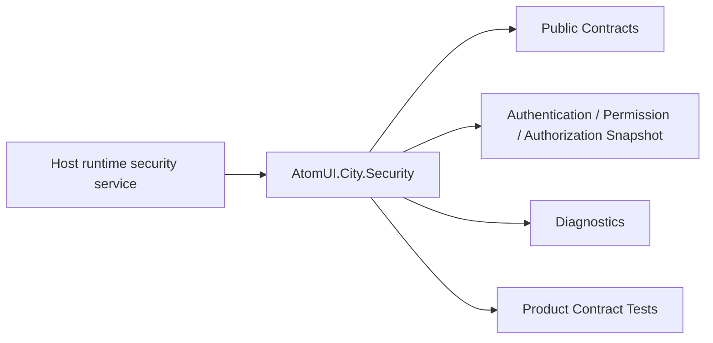

# AtomUI.City.Security Architecture

## 架构目标

AtomUI.City.Security 的架构目标是把模块职责变成可实现、可测试、可 review 的产品级合同。

- 集中表达当前用户和认证状态。
- 统一权限、策略、路由和命令授权。

## 核心不变量

- Security 不实现登录 UI。
- 认证状态以 immutable snapshot 发布。
- 授权评估不操作 UI 或导航。
- access token 失败返回 AccessTokenResult。
- 事件观察者不能回滚已提交状态或阻断其他观察者。
- Token、BootstrapContext 和完整 claims 不得进入 snapshot 或 diagnostics。

## 核心概念和所有权

| 概念 | 职责 | 创建者 | 释放/失效规则 |
| --- | --- | --- | --- |
| AuthenticationStateSnapshot | principal 和状态快照。 | AuthenticationStateStore | 不可变。 |
| PermissionRegistry | 权限定义注册表。 | DI | Host/plugin owner 管理。 |
| AuthorizationEvaluator | 策略评估。 | DI | 无状态。 |
| CommandAuthorizationSource | 把认证、权限和 descriptor revision 汇总为命令授权状态。 | DI singleton | Dispose 释放上游订阅并停止新通知。 |
| IHostDiagnostics | 承接 Security 稳定诊断码。 | Core Host | Security 不拥有或完成该实例。 |
| FileAccountSessionStore / FileCredentialStore | 多账号资料、权限、凭据和活动指针的版本化原子文件存储。 | DI singleton | Host 生命周期；文件在显式删除前跨进程保留。 |
| AccountSessionManager | 枚举、恢复、切换、刷新和删除账号，发布唯一活动会话。 | DI singleton | Host 生命周期；账号事务按 Host 串行化。 |

## 产品级状态机

- Authentication 使用 Unknown、Anonymous、Authenticating、Authenticated、Refreshing、Expired、SignedOut、Failed 状态词汇；当前 Store 校验每个 snapshot 的内容一致性，但不强制业务流程的转换图，认证编排器负责选择下一状态。
- Authorization result: Allowed / Denied / Forbidden / Challenge / Failed / Cancelled
- Account session: Anonymous -> Restoring / Switching -> Online 或 OfflineRestricted；失败保持原 session；删除活动账号后进入 Anonymous/SignedOut。

## 关键运行流程

- AuthenticationStateStore 发布 snapshot。
- PermissionRegistry 注册 permission。
- AuthorizationEvaluator 评估 policy。
- RouteGuard 映射 result。
- CommandAuthorizationSource 汇总 revision 并发布有序通知。
- IAccessTokenProvider 返回稳定 result，诊断中不包含凭据。
- IAccountSessionManager 先加载同一账号的资料、权限和凭据，验证完成后才发布完整活动会话。

## 失败矩阵

- 权限未注册：授权失败。
- policy provider 缺失：返回 Failed。
- token provider 不可用。
- 事件观察者抛异常：隔离该观察者、继续其他观察者并写诊断。
- 非调用方取消产生的 OperationCanceledException：按 provider/evaluator failure 处理，不伪装为 Cancelled。

## 性能和资源边界

- 权限查找使用 registry 索引。
- AuthorizationEvaluator 不做网络 IO。
- 认证、权限和命令通知使用有序单消费者 drain；用户观察者在内部锁外执行。
- CLR 事件观察者必须保持短小且不得阻塞；持续并发写入遇到阻塞观察者时，待发布通知会在内存中排队。
- 多账号文件 IO 由 store singleton 串行化；写入通过同目录临时文件原子替换；账号恢复、切换、刷新和删除由 manager 按 Host 串行化。

## 运行时对象模型

## 扩展点模型

- 扩展点只能通过 public API、DI、attribute、manifest、source generator 输出、MSBuild property、CLI command 或 template variable 暴露。
- 新增扩展点必须同步更新 [features.md](features.md)、[api-contracts.md](api-contracts.md)、[testing.md](testing.md) 和 [compatibility.md](compatibility.md)。
- 插件来源扩展点必须有 owner 和撤销路径。

## AOT 和 Trimming 约束

- 当前 Security runtime 不执行程序集反射扫描；权限、policy、route 和 command descriptor 通过显式 API/DI provider 注册。
- 多账号文件 Provider 使用 `System.Text.Json` source-generated metadata 序列化固定 schema DTO，不依赖运行时反射发现持久化类型。
- Security 专属 source generator/manifest 尚未分配 Feature ID，也没有源码实现，不属于当前完成能力。
- 后续如引入 generated manifest，必须先登记 Feature ID，并定义稳定排序、诊断、AOT 和增量构建测试。
