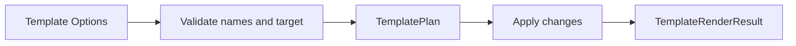

# AtomUI.City.Templates Architecture

## 架构目标

AtomUI.City.Templates 的目标是提供应用、模块、插件、页面、配置、测试和本地化模板，让 CLI 与 `dotnet new` 生成符合框架工程约束的项目骨架。`GenerationTemplateRenderer` 承接非插件的工作区增量生成；插件生成仍只保留现有独立 `dotnet new` 模板。

- 模板输出必须能直接 restore/build/test。
- 模板默认命名、包引用、目录结构和 license 与仓库规范一致。
- 模板变量校验明确，失败不会写入半成品项目。

## 核心不变量

- 模板渲染必须先生成 TemplatePlan，再执行文件写入。
- 文件写入不得越过目标根目录。
- TemplateChange 路径必须规范化为相对路径，重复 normalized path 必须在 TemplatePlan.Validate 中失败。
- 已存在文件默认不覆盖，除非显式指定覆盖策略。
- 模板输出不得包含占位文本或不合法项目引用。
- 同一目标目录的进程内 render 必须串行；不同进程并发时仍必须依靠原子 create-new 防止覆盖。
- NuGet 模板必须经过真实 pack、install、instantiate 测试，不能用源目录布局测试代替。

## 核心概念和所有权

| 概念 | 职责 | 创建者 | 释放/失效规则 |
| --- | --- | --- | --- |
| ApplicationTemplateOptions | 应用模板输入和命名规则。 | CLI 或测试 | 单次渲染只读。 |
| ApplicationTemplateRenderer | 生成 TemplatePlan 并执行渲染。 | DI 或 CLI | 业务无状态，可复用；内部 keyed gate 只在进行中的同目标 render 期间存在。 |
| GenerationTemplateOptions | module/page/test/config/localization 的工作区增量输入。 | CLI 或测试 | 单次 operation 只读。 |
| GenerationTemplateRenderer | 生成增量 plan 并执行 create-only 事务。 | CLI 或测试 | 无状态；同 output root 的 gate 在事务结束后释放。 |
| TemplatePlan | 待创建、修改、跳过和冲突的文件清单。 | renderer | 执行前不可变。 |
| TemplateChange | 单个文件变更 contract。 | renderer | 应用后进入结果。 |
| TemplateRenderResult | 渲染结果、diagnostics 和 artifact 列表。 | renderer | 输出后不可变。 |

## 渲染流程

## 失败矩阵

| 场景 | 行为 | 必须测试 |
| --- | --- | --- |
| 项目名非法 | 不写文件，返回 validation diagnostic。 | TemplatePackageLayoutTests |
| 目标目录逃逸 | 拒绝执行。 | TemplatePackageLayoutTests |
| plan 包含重复 normalized path | 返回 `AUCTPL1002`。 | TemplatePackageLayoutTests |
| 文件冲突且未允许覆盖 | plan 标记 conflict，render 失败。 | ApplicationTemplateBuildSmokeTests |
| 写入中途失败 | 删除本次创建文件和空目录；返回 `AUCTPL1005`，回滚失败追加 `AUCTPL1006`。 | ApplicationTemplateBuildSmokeTests |
| 同目录并发生成 | 一个完整成功，其余调用在串行预检后以冲突失败，不产生混合树。 | ApplicationTemplateBuildSmokeTests |
| NuGet 模板 token 污染 | 真实实例化测试失败，尤其断言 `AtomUICityPlugin*` 属性名保持不变。 | DotnetNewTemplateIntegrationTests |
| 模板输出 build 失败 | smoke test 失败。 | ApplicationTemplateBuildSmokeTests |
| 模板包缺失关键文件 | package layout 测试失败。 | TemplatePackageLayoutTests |

## 扩展点模型

模板扩展点包括 template variable、template package layout、CLI command 参数和 smoke test baseline。新增模板必须同步更新 [features.md](features.md)、[api-contracts.md](api-contracts.md)、[testing.md](testing.md) 和 CLI 文档。
